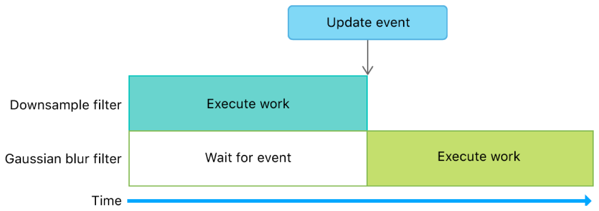
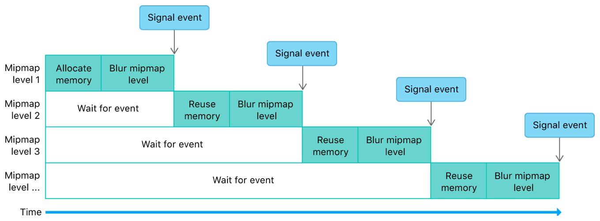
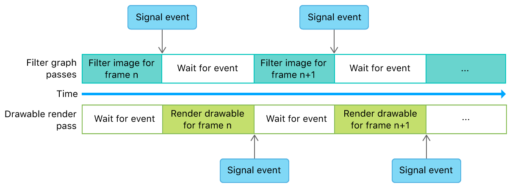

# Image Filter Graph with Heaps and Events

Demonstrates how to use heaps and events to optimize a multistage image filter.

## Overview

This sample demonstrates:

* Using events instead of fences to manage resource dependencies and work synchronization
* Creating heaps for static and dynamic textures
* Using aliasing to reduce the amount of memory used for temporary resources
* Using events to manage dependencies between encoders that produce and consume dynamic textures


This implementation minimizes memory usage in an orderly fashion for a filter graph with a downsample and Gaussian blur filter. For more information, including implementation details about heaps for static and dynamic textures, see [Image Filter Graph with Heaps and Fences](https://developer.apple.com/documentation/metal/heaps/image_filter_graph_with_heaps_and_fences).

## Getting Started

The Xcode project contains schemes for running the sample on macOS, iOS, or tvOS.  The default scheme is macOS, which runs the sample as is on your Mac.

## Compare Events with Fences

The `MTLFence` API allows you to specify synchronization points in your app that wait for a workload to complete execution, provided that execution begins *before* a fence is encountered. However, this synchronization mechanism means that your app can't wait for a workload to complete execution if the execution begins *after* a fence is encountered. A fence can wait for workloads that have already begun, but it can't wait for future workloads.

Fences work well in an image filter graph because each filter in the graph is applied sequentially. You can use a fence to wait for one filter to complete execution before you begin executing another.

In contrast, although the `MTLEvent` API also allows you to specify similar synchronization points in your app, it allows for more flexibility than the `MTLFence` API. Unlike fences, events can wait for workloads that have already begun, as well as future workloads. Additionally, events are specified outside command encoder boundaries, not between the encoded commands of a command encoder. Because the event synchronization mechanism is implemented in the command buffer scheduler, events block workloads at the command buffer level within the GPU. Therefore, command buffers on one queue can execute while a command buffer on another queue is blocked by an event.

Events also work well in an image filter graph because they provide the equivalent functionality of fences. However, events are easier to specify and track because their synchronization mechanism is managed with a discrete signal value that increases monotonically. Using this signal value, events insert a strict execution order between command encoder boundaries in the GPU.

## Implement an Event Wrapper for Synchronization Routines

The sample wraps the `MTLEvent` API in the `AAPLEventWrapper` protocol accessed through an `AAPLSingleDeviceEventWrapper` object. This convenience wrapper encapsulates the main synchronization mechanism, and primarily manages the discrete signal value through the `_signalCounter` variable.

- Note: Because the event's signal counter is wrapped within `AAPLSingleDeviceEventWrapper`, it can be used as a bridge between two or more nodes that depend on each other in an execution graph. Without this bridge, the signal counter and the `MTLEvent` object wouldn't be tightly paired, and this potential mismatch could lead to synchronization errors in your code (for example, you might use a wrong `MTLEvent` object for a signal counter, or vice versa).

The sample calls the `wait:` method to wait for a workload to complete execution.

``` objective-c
- (void) wait:(_Nonnull id <MTLCommandBuffer>)commandBuffer
{
    assert([_event.class conformsToProtocol:@protocol(MTLSharedEvent)] || (commandBuffer.device == _event.device));
    
    // Wait for the event to be signaled
    [commandBuffer encodeWaitForEvent:_event value:_signalCounter];
}
```

The sample calls the `signal:` method to signal that a workload has completed execution. (This method increments the value of `_signalCounter`.)

``` objective-c
- (void) signal:(_Nonnull id<MTLCommandBuffer>)commandBuffer
{
    assert([_event.class conformsToProtocol:@protocol(MTLSharedEvent)] || (commandBuffer.device == _event.device));

    // Increase the signal counter
    ++_signalCounter;
    // Signal the event
    [commandBuffer encodeSignalEvent:_event value:_signalCounter];
}
```

- Note: You can reimplement this wrapper to support any other type of synchronization primitive, such as `MTLSharedEvent`, `MTLFence`, or CPU-side routines.

## Manage Dependencies Between Filters

The sample uses `_event` to control access to dynamic textures allocated from `_scratchHeap` and prevent GPU race conditions in the filter graph. The event ensures that operations on dynamic textures are completed before the filter graph begins subsequent operations that depend on the result of previous operations.

At the start of the filter graph, the sample calls the `wait:` method to ensure that the previous frame has completed execution.

``` objective-c
[event wait:commandBuffer];
```

The first filter, implemented by the sample in `AAPLDownsampleFilter`, creates a dynamic texture, `outTexture`, from the heap and allocates enough space for mipmaps.

``` objective-c
MTLTextureDescriptor *textureDescriptor = [MTLTextureDescriptor texture2DDescriptorWithPixelFormat:inTexture.pixelFormat
                                                                                             width:inTexture.width
                                                                                            height:inTexture.height
                                                                                         mipmapped:YES];
textureDescriptor.storageMode = heap.storageMode;
textureDescriptor.usage = MTLTextureUsageShaderWrite | MTLTextureUsageShaderRead;

id <MTLTexture> outTexture = [heap newTextureWithDescriptor:textureDescriptor];
```

Next, the downsample filter blits a source texture, `inTexture`, to `outTexture` and generates the mipmaps. The sample then calls the `endEncoding` method to finalize the blit pass.

``` objective-c
[blitCommandEncoder copyFromTexture:inTexture
                        sourceSlice:0
                        sourceLevel:0
                       sourceOrigin:(MTLOrigin){ 0, 0, 0 }
                         sourceSize:(MTLSize){ inTexture.width, inTexture.height, inTexture.depth }
                          toTexture:outTexture
                   destinationSlice:0
                   destinationLevel:0
                  destinationOrigin:(MTLOrigin){ 0, 0, 0}];

[blitCommandEncoder generateMipmapsForTexture:outTexture];

[blitCommandEncoder endEncoding];
```

Finally, the downsample filter calls the `signal:` method to indicate that its operations are complete.

``` objective-c
[event signal:commandBuffer];
```

The second filter, implemented by the sample in `AAPLGaussianBlurFilter`, calls the `wait:` method immediately before creating a compute command encoder. This forces the Gaussian blur filter to wait for the downsample filter to complete its work before beginning its own work. A waiting period is necessary because the Gaussian blur filter depends on dynamic texture data generated by the downsample filter. Without the event, the GPU could execute both filters in parallel, and thus read uninitialized dynamic texture data allocated from the heap.

``` objective-c
[event wait:commandBuffer];
```



## Reuse Memory and Manage Dependencies Within a Filter

The Gaussian blur filter performs a horizontal blur and a vertical blur for each mipmap level of the dynamic texture produced by the downsample filter. For each mipmap level, the sample allocates a temporary texture, `intermediaryTexture`, from the dynamic textures heap.

``` objective-c
id <MTLTexture> intermediaryTexture = [heap newTextureWithDescriptor:textureDescriptor];
```

This texture is temporary because it's used only as an output destination from the horizontal blur and as an input source to the vertical blur. After the sample executes these blurs, the final texture data is stored in `outTexture` (which is a texture view of `inTexture`). Therefore, the texture data contained in `intermediaryTexture` is unused after each mipmap level iteration.

``` objective-c
// Perform horizontal blur using the input texture as an input
// and a view of the mipmap level of input texture as the output

[computeEncoder setComputePipelineState:_horizontalKernel];

[computeEncoder setTexture:inTexture
                   atIndex:AAPLBlurTextureIndexInput];

[computeEncoder setTexture:intermediaryTexture
                   atIndex:AAPLBlurTextureIndexOutput];

[computeEncoder setBytes:&mipmapLevel
                  length:sizeof(mipmapLevel)
                 atIndex:AAPLBlurBufferIndexLOD];

[computeEncoder dispatchThreadgroups:threadgroupCount
               threadsPerThreadgroup:threadgroupSize];

// Perform vertical blur using the horizontally blurred texture as an input
// and a view of the mipmap level of the input texture as the output

[computeEncoder setComputePipelineState:_verticalKernel];

[computeEncoder setTexture:intermediaryTexture
                   atIndex:AAPLBlurTextureIndexInput];

[computeEncoder setTexture:outTexture
                   atIndex:AAPLBlurTextureIndexOutput];

static const uint32_t mipmapLevelZero = 0;
[computeEncoder setBytes:&mipmapLevelZero
                  length:sizeof(mipmapLevelZero)
                 atIndex:AAPLBlurBufferIndexLOD];

[computeEncoder dispatchThreadgroups:threadgroupCount
               threadsPerThreadgroup:threadgroupSize];
```

After blurring each mipmap level, the sample calls the `endEncoding` method to indicate that the compute operations for the given mipmap level are complete.

``` objective-c
[computeEncoder endEncoding];
```

Instead of allocating new memory for each mipmap level, the sample reuses the existing memory allocated for `intermediaryTexture`. After each mipmap level iteration, the sample calls the `makeAliasable` method to indicate that this memory can be reused by subsequent allocations from the same dynamic textures heap.

``` objective-c
[intermediaryTexture makeAliasable];
```

This memory reuse creates dynamic texture dependencies between mipmap levels. Therefore, after blurring each mipmap level, the sample also calls the `signal:` method to indicate that the blur operations for the given mipmap level are complete.

``` objective-c
[event signal:commandBuffer];
```

Because the sample already calls the `wait:` method to wait for the downsample filter to complete its work, the sample leverages this same call to wait for any previous mipmap levels to complete their work before beginning a new mipmap level iteration.



## Manage Dependencies Between Frames

The sample calls the `wait:` method to wait for the filter graph to complete execution before rendering the filtered image to a drawable.

``` objective-c
// Wait for the filter graph to complete execution
[_event wait:commandBuffer];

// Obtain a render pass descriptor generated from the view's drawable textures
MTLRenderPassDescriptor* renderPassDescriptor = _view.currentRenderPassDescriptor;
```

The sample then renders the filtered image and schedules a drawable presentation.

``` objective-c
[commandBuffer presentDrawable:_view.currentDrawable];
```

Finally, the sample calls the `signal:` method to indicate that the frame has been completed and rendered.

``` objective-c
// Signal event for the frame completion
[_event signal:commandBuffer];

// Finalize rendering for the frame
[commandBuffer commit];
```


