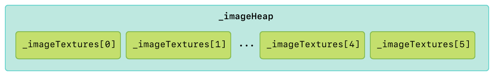
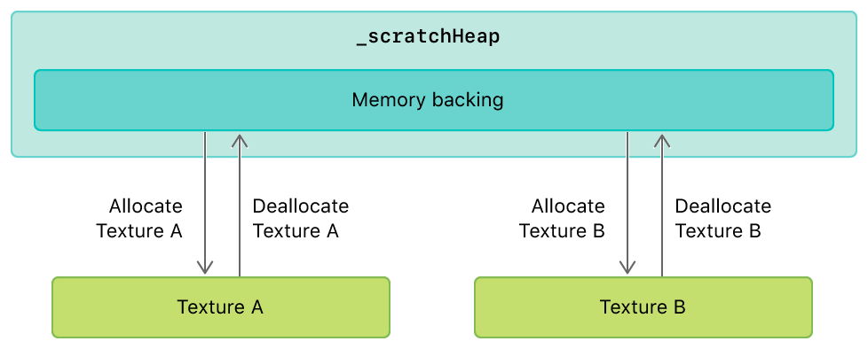
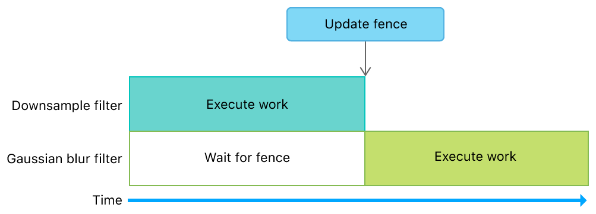
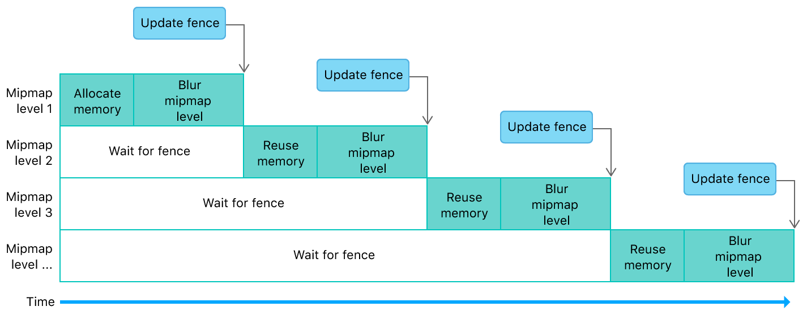

# Image Filter Graph with Heaps and Fences

Demonstrates how to use heaps and fences to optimize a multistage image filter.

## Overview

This sample demonstrates:

* Creating heaps for static and dynamic textures
* Using aliasing to reduce the amount of memory used for temporary resources
* Using fences to manage dependencies between encoders that produce and consume dynamic textures

This implementation minimizes memory usage in an orderly fashion for a filter graph with a downsample and a Gaussian blur filter.


## Getting Started

The Xcode project contains schemes for running the sample on macOS, iOS, or tvOS. Metal is not supported in the iOS or tvOS Simulator, so the iOS and tvOS schemes require a physical device to run the sample. The default scheme is macOS, which runs the sample as is on your Mac.

## Optimize Resource Allocation and Performance

Storing textures in a heap gives the sample more control over how resource memory is allocated and accessed. It's also much faster to allocate resources from a heap than from a device. When resources are allocated from a device, Metal creates and tracks additional state to ensure that the resource memory is allocated, synchronized, and made available throughout the lifetime of any command buffer that needs the given resource. It does so even if the resource itself is destroyed before the command buffer begins execution.

Although Metal also carries out this process for heaps, it doesn't do so for resources within the heap. Instead, the app must perform explicit fine-grained synchronization when it creates objects from the heap and reuses memory. However, the overall cost of allocating resources from a heap is much lower than that of allocating resources from a device, particularly in the middle of a frame.

## Create a Heap for Static Textures

The sample loads image files into an array called `_imageTextures`. Instead of using `_imageTextures` directly, the sample uses `_imageHeap`, from which it allocates static textures. The sample creates a heap large enough to store all the static textures by aggregating their sizes. For each texture in `_imageTextures`, the sample calls the `heapTextureSizeAndAlignWithDescriptor:` method to calculate the size and alignment values required to allocate sufficient memory backing for each texture.

``` objective-c
for(uint32_t i = 0; i < AAPLNumImages; i++)
{
    // Create a descriptor using the texture's properties
    MTLTextureDescriptor *descriptor = [AAPLRenderer newDescriptorFromTexture:_imageTextures[i]
                                                                  storageMode:heapDescriptor.storageMode];

    // Determine the size needed for the heap from the given descriptor
    MTLSizeAndAlign sizeAndAlign = [_device heapTextureSizeAndAlignWithDescriptor:descriptor];

    // Align the size so that more resources will fit after this texture
    sizeAndAlign.size = alignUp(sizeAndAlign.size, sizeAndAlign.align);

    // Accumulate the size required for the heap to hold this texture
    heapDescriptor.size += sizeAndAlign.size;
}

// Create a heap large enough to hold all resources
_imageHeap = [_device newHeapWithDescriptor:heapDescriptor];
```

For each texture in `_imageTextures`, the sample allocates a new texture, `heapTexture`, from the heap.

``` objective-c
MTLTextureDescriptor *descriptor = [AAPLRenderer newDescriptorFromTexture:_imageTextures[i]
                                                              storageMode:_imageHeap.storageMode];

// Create a texture from the heap
id<MTLTexture> heapTexture = [_imageHeap newTextureWithDescriptor:descriptor];
```

The sample blits the contents of `_imageTextures[i]` to `heapTexture`, and then replaces `_imageTextures[i]` with `heapTexture`.

``` objective-c
MTLRegion region = MTLRegionMake2D(0, 0, _imageTextures[i].width, _imageTextures[i].height);

for(NSUInteger level = 0; level < _imageTextures[i].mipmapLevelCount;  level++)
{
    for(NSUInteger slice = 0; slice < _imageTextures[i].arrayLength; slice++)
    {
        [blitEncoder copyFromTexture:_imageTextures[i]
                         sourceSlice:slice
                         sourceLevel:level
                        sourceOrigin:region.origin
                          sourceSize:region.size
                           toTexture:heapTexture
                    destinationSlice:slice
                    destinationLevel:level
                   destinationOrigin:region.origin];
    }

    region.size.width /= 2;
    region.size.height /= 2;
    if(region.size.width == 0) region.size.width = 1;
    if(region.size.height == 0) region.size.height = 1;
}

// Replace the original texture with new texture from the heap
_imageTextures[i] = heapTexture;
```



## Create a Heap for Dynamic Textures

The sample uses a separate heap, `_scratchHeap`, from which it allocates dynamic textures with a temporary lifetime. These textures have the same properties of the static texture being filtered in a given frame.

``` objective-c
id<MTLTexture> inTexture = _imageTextures[_currentImageIndex];

[self createScratchHeap:inTexture];
```

The sample uses `_scratchHeap` to quickly allocate temporary textures for the downsample and Gaussian blur filters. Thus, the required size and alignment values for `_scratchHeap` are equal to the sum of the same required values for each filter.

``` objective-c
MTLSizeAndAlign downsampleSizeAndAlignRequirement = [_downsample heapSizeAndAlignWithInputTextureDescriptor:descriptor];
MTLSizeAndAlign gaussianBlurSizeAndAlignRequirement = [_gaussianBlur heapSizeAndAlignWithInputTextureDescriptor:descriptor];

NSUInteger requiredAlignment = MAX(gaussianBlurSizeAndAlignRequirement.align, downsampleSizeAndAlignRequirement.align);
NSUInteger gaussianBlurSizeAligned = alignUp(gaussianBlurSizeAndAlignRequirement.size, requiredAlignment);
NSUInteger downsampleSizeAligned = alignUp(downsampleSizeAndAlignRequirement.size, requiredAlignment);
NSUInteger requiredSize = gaussianBlurSizeAligned + downsampleSizeAligned;

if(!_scratchHeap || requiredSize > [_scratchHeap maxAvailableSizeWithAlignment:requiredAlignment])
{
    MTLHeapDescriptor *heapDesc = [[MTLHeapDescriptor alloc] init];

    heapDesc.size        = requiredSize;
    heapDesc.storageMode = heapStorageMode;

    _scratchHeap = [_device newHeapWithDescriptor:heapDesc];
}
```

Any textures allocated from `_scratchHeap` can also be deallocated, which allows the sample to reuse that same memory backing to allocate another texture. This memory reuse is known as *aliasing*.



## Manage Dependencies Between Filters

The sample uses `_fence` to control access to dynamic textures allocated from `_scratchHeap` and prevent GPU race conditions in the filter graph. This fence ensures that operations on dynamic textures are completed before the filter graph begins subsequent operations that depend on the results of previous operations.

The first filter, implemented by the sample in `AAPLDownsampleFilter`, creates a dynamic texture, `outTexture`, from the heap and allocates enough space for mipmaps.

``` objective-c
MTLTextureDescriptor *textureDescriptor = [MTLTextureDescriptor texture2DDescriptorWithPixelFormat:inTexture.pixelFormat
                                                                                             width:inTexture.width
                                                                                            height:inTexture.height
                                                                                         mipmapped:YES];
textureDescriptor.storageMode = heap.storageMode;
textureDescriptor.usage = MTLTextureUsageShaderWrite | MTLTextureUsageShaderRead;

id <MTLTexture> outTexture = [heap newTextureWithDescriptor:textureDescriptor];
```

The downsample filter then blits a source texture, `inTexture`, to `outTexture` and generates the mipmaps.

``` objective-c
[blitCommandEncoder copyFromTexture:inTexture
                        sourceSlice:0
                        sourceLevel:0
                       sourceOrigin:(MTLOrigin){ 0, 0, 0 }
                         sourceSize:(MTLSize){ inTexture.width, inTexture.height, inTexture.depth }
                          toTexture:outTexture
                   destinationSlice:0
                   destinationLevel:0
                  destinationOrigin:(MTLOrigin){ 0, 0, 0}];

[blitCommandEncoder generateMipmapsForTexture:outTexture];
```

Finally, the downsample filter calls the `updateFence:` and `endEncoding` methods to indicate that its operations are complete.

``` objective-c
[blitCommandEncoder updateFence:fence];

[blitCommandEncoder endEncoding];
```

The second filter, implemented by the sample in `AAPLGaussianBlurFilter`, calls `waitForFence:` immediately after creating a compute command encoder. This forces the Gaussian blur filter to wait for the downsample filter to complete its work before beginning its own work. A waiting period is necessary because the Gaussian blur filter depends on dynamic texture data generated by the downsample filter. Without the fence, the GPU could execute both filters in parallel, and thus read uninitialized dynamic texture data allocated from the heap.

``` objective-c
[computeEncoder waitForFence:fence];
```



## Reuse Memory and Manage Dependencies Within a Filter

The Gaussian blur filter performs a horizontal blur and a vertical blur for each mipmap level of the dynamic texture produced by the downsample filter. For each mipmap level, the sample allocates a temporary texture, `intermediaryTexture`, from the dynamic textures heap.

``` objective-c
id <MTLTexture> intermediaryTexture = [heap newTextureWithDescriptor:textureDescriptor];
```

This texture is temporary because it's used only as an output destination from the horizontal blur and as an input source to the vertical blur. After the sample executes these blurs, the final texture data is stored in `outTexture` (which is a texture view of `inTexture`). Therefore, the texture data contained in `intermediaryTexture` is unused after each mipmap level iteration.

``` objective-c
// Perform horizontal blur using the input texture as an input
// and a view of the mipmap level of input texture as the output

[computeEncoder setComputePipelineState:_horizontalKernel];

[computeEncoder setTexture:inTexture
                   atIndex:AAPLBlurTextureIndexInput];

[computeEncoder setTexture:intermediaryTexture
                   atIndex:AAPLBlurTextureIndexOutput];

[computeEncoder setBytes:&mipmapLevel
                  length:sizeof(mipmapLevel)
                 atIndex:AAPLBlurBufferIndexLOD];

[computeEncoder dispatchThreadgroups:threadgroupCount
               threadsPerThreadgroup:threadgroupSize];

// Perform vertical blur using the horizontally blurred texture as an input
// and a view of the mipmap level of the input texture as the output

[computeEncoder setComputePipelineState:_verticalKernel];

[computeEncoder setTexture:intermediaryTexture
                   atIndex:AAPLBlurTextureIndexInput];

[computeEncoder setTexture:outTexture
                   atIndex:AAPLBlurTextureIndexOutput];

static const uint32_t mipmapLevelZero = 0;
[computeEncoder setBytes:&mipmapLevelZero
                  length:sizeof(mipmapLevelZero)
                 atIndex:AAPLBlurBufferIndexLOD];

[computeEncoder dispatchThreadgroups:threadgroupCount
               threadsPerThreadgroup:threadgroupSize];
```

Instead of allocating new memory for each mipmap level, the sample reuses the existing memory allocated for `intermediaryTexture`. After each mipmap level iteration, the sample calls the `makeAliasable` method to indicate that this memory can be reused by subsequent allocations from the same dynamic textures heap.

``` objective-c
[intermediaryTexture makeAliasable];
```

This memory reuse creates dynamic texture dependencies between mipmap levels. Therefore, after blurring each mipmap level, the sample calls the `updateFence:` and `endEncoding` methods to indicate that the blur operations are complete.

``` objective-c
[computeEncoder updateFence:fence];

[computeEncoder endEncoding];
```

Because the sample already calls the `waitForFence:` method to wait for the downsample filter to complete its work, the sample leverages this same call to wait for any previous mipmap levels to complete their work before beginning a new mipmap level iteration.


